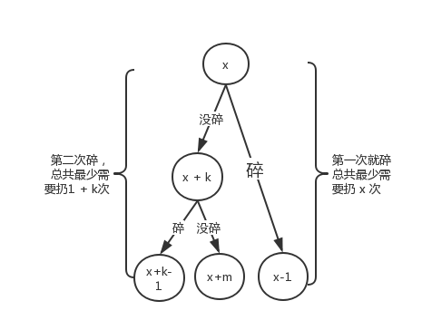
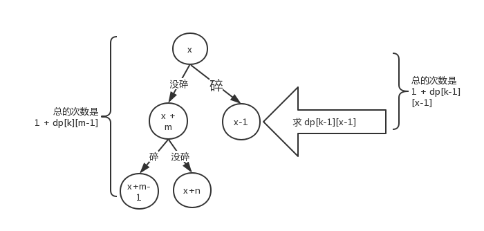

google 有一道类似的面试题，两个鸡蛋，它们有可能都在一楼就摔碎，也可能从一百层楼摔下来没事。有座100层的建筑，要你用这两个鸡蛋通过最少的次数确定哪一层是鸡蛋可以安全落下的最高位置。可以摔碎两个鸡蛋

这道题算是google这题的加强版。

先看看google这题的思路,这里我们需要用动态规划的思想来看这道题。我们每次扔鸡蛋只会出现两种结果，摔碎和没摔碎。假设第一次扔的高度为 x 

- 如果摔碎，则我们还需要扔最少 x - 1 次才能确认结果
- 如果没摔碎，则我们需要确认下一次扔的高度

如果没碎，假设我们下一次往上爬 k 层楼再扔，我们可以把所有情况看做一棵树

为了保证所有的情况都不太坏，我们需要保证每种情况扔的最少次数都可能的相等。所以可以得到 1 + k = x => k = x - 1,即第二次上升的楼层数，得是第一次的的楼层数减一。同理如果没碎的话，我们每次需要再上一次上升的高度数减一。

我们考虑一下极端情况，如果我们每次都没有摔碎鸡蛋，直到最后一次才摔碎的情况,这时最后一次的高度是 100,
第一次扔的上升楼层数是x,第二次是 x-1, .... 直到1，可以得到我们最后一次扔的高度
`h = x + x - 1 + ... + 1 = x * (x + 1) / 2`
h >= 100 => 可以得到 x >= 13.5, 由于 x 只能取整，所以我们最小要取14

所以这题我们最多可以在14次以内找到结果。

再来看这道题，将条件限制成了 K 个鸡蛋

- K = 0的时候，我们是试不出来的
- K = 1时，我们只能从1楼一层一层往上试，次数为楼层高度 n
- K = 2时，情况和上面一样
- k > 2时，和google这道题就不太一样了

这里我们只分析 K > 2这种情况，我们每次扔的结果还是碎和不碎，不碎的情况还是和上面一样，继续找下一次扔的高度，碎的情况就有点不一样了，我们需要根据我们剩余的鸡蛋数来动态的调整下一次扔的高度

假设 dp[k][n] 为 k 个鸡蛋，n 层楼时的解

- k = 0 , dp[k][n] = 0
- k = 1, dp[k][n] = n
- k = 2, dp[k][n] = 

当 k > 2时

假设我们还剩 m 个鸡蛋，还需要实验 n 层楼，此时 1 <= n <= h, 假设我们已经知道了 1 ~ n 层最优解，假设这时候第一次丢的高度为 y ，丢的时候会出现两种情况

#### 碎了

则此时的最优解为 f(m - 1, y - 1) + 1

#### 没碎

则此时的最优解为 f(m, n - y) + 1

由此我们可以得到 f(m, n) = min(max(f(m - 1, y - 1), f(m, n - y)) + 1), 1<=y< n，由此我们可以递推的得到 f(K,N)

这题后面还需要优化，由于复杂度较高，需要一定的基础，暂时没有继续优化下去

推荐一个人的博客，把合体分析的非常透彻，有兴趣的可以看看
[博客地址](https://charlesliuyx.github.io/2018/10/11/%E3%80%90%E7%9B%B4%E8%A7%82%E7%AE%97%E6%B3%95%E3%80%91Egg%20Puzzle%20%E9%B8%A1%E8%9B%8B%E9%9A%BE%E9%A2%98/)

[源码](./index.js)